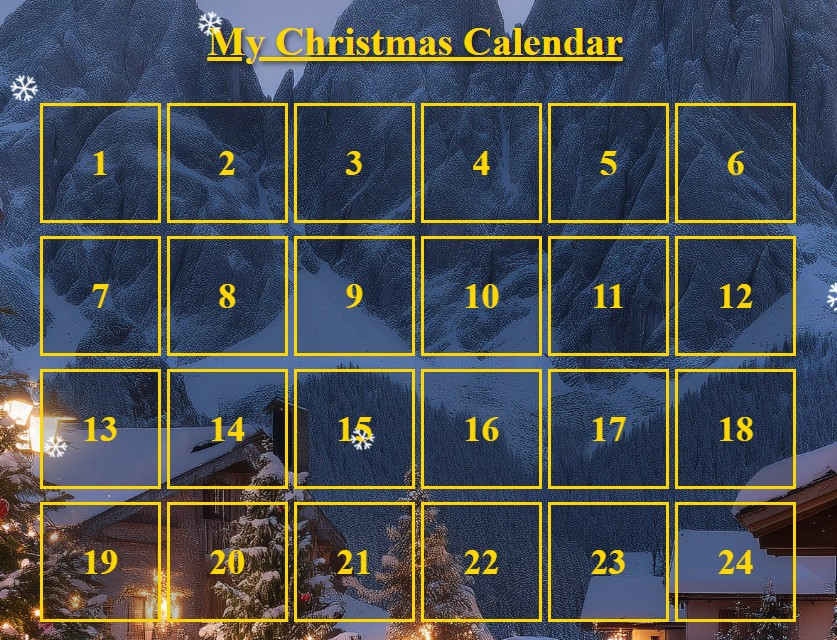
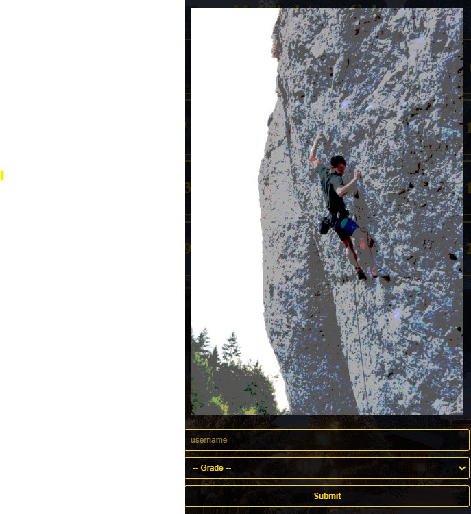

# Advent Calendar App

This project is a small, browser-based advent calendar app. It was intended to share pictures of climbs I took and let my friends guess the grades of the routes displayed. The guesses are stored in a Baserow from which a leaderboard and additional statistics are created and displayed.
It is a just for fun project. Cheating is very easy with some computer skills and so far no attempts to secure the app from it have been undertaken (see section on cheating).






## Quick start

1. Copy the project folder to your own machine or GitHub repository.
2. Put your images into the images folder.
3. Edit [calendar.json](calendar.json) to add your calendar entries.
4. Edit [config.json](config.json) if you want leaderboard support with Baserow.
5. Prepare your version for online publication


## Project files

- [index.html](index.html) - main page structure
- [style.css](style.css) - styling
- [script.js](script.js) - app logic, popup handling, leaderboard, and Baserow integration
- [calendar.json](calendar.json) - information about the climbing images (filenames, routenames, grades)
- [config.json](config.json) - app configuration and Baserow settings
- [information.txt](information.txt) - text shown in the info popup for first-time website visitors
- [images/](images) - place your images here

## How to add images

Place your image files inside the [images](images) folder.

Example:
You have a picture of that cool 7a you did in Kalymnos named "amazing-climb.jpg". I suggest to downscale it first for it to load faster on the website (reduce size and quality so it takes about or less than 1MB of space). Place it in the images folder alongside 23 other pictures you prepared.

images/amazing-climb.jpg

Next, head over to calendar.json and reference all your images there. Decide on which date they should be displayed and what grade(s) are correct. Sometimes more than one grade will be right, because the route has a left and a right version etc. In this case, add all the grades that should be correct.

day_to_display: On this date of the month the picture will be seen and grades should be guessed (values 1 to 24).
image: relative path to the image with the correct image name.
name: Name of the route or any other information that should be displayed below the picture (only visible on the next day).
grade: Here you can add all grades that should be treated as correct. The picture of our amazing route is right at a spot where it traverses a 6b. As from the picture it's not visible which route is climbed it's only fair to make both grades count.

In our case this results in the following entry in calendar.json:

```json
{
  "day_to_display": 1,
  "image": "images/amazing-climb.jpg",
  "name": "John in 'Route Perfect', Kalymnos, Greece",
  "grade": ["7a", "6b"]
}
```

### Important notes for image names

- Make sure you set the image field exactly to the image name.
- It might be better not to add the grade or route name to the file name (see cheating)
- Spaces are fine, but keeping names short and predictable helps avoid mistakes.
- If you upload the images as full size photographs they will take some time loading in the online version. Downscale it to about the size of a screen and maybe reduce the jpg quality. This can be done with Image-editing software.


## How to customize the popup text

Users who are unsure what the website is about can click on the questionmark button in the bottom right corner.

The text shown in this popup comes from [information.txt](information.txt).

You can replace its contents with your own message, instructions, or credits.

## Baserow setup

The calander is made for interactivity. People should guess the grades, see what others guessed and who's the best guesser at the moment.
To enable this feature an additional Database setup is necessary. I reccomend Baserow, because it is free for small to medium scale purposes (3000 free rows = 24 days * 125 players). The setup is actually quite easy:


### 1. Create a Baserow account

1. Go to [Baserow](https://baserow.io/) and create an account.
2. After logging in, create a new workspace (if you do not already have one).
3. Create a new database. You can give it any name you like

A database contains tables. The table is where the app will store the data.

### 2. Create a new table

Inside your database, create a new table.

A table works like an Excel spreadsheet:

* **Columns** describe what information is stored.
* **Rows** contain the actual data for each player.

Create the following columns:

| Column name  | Purpose                                  |
| ------------ | ---------------------------------------- |
| `player`     | The name or identifier of the player     |
| `day`        | The calendar day or game day             |
| `points`     | The number of points the player received |
| `grade`      | The displayed grade or rating            |
| `trueGrades` | The actual grade values used by the app  |

The column names must match **exactly**. The app looks for these names and will not work correctly if they are changed.


### 3. Get your Baserow table ID

The app needs to know which Baserow table it should access.

1. Open your new table in Baserow.
2. Look at the URL in your browser. It will look something like:

```
https://baserow.io/database/123456/table/789012
```

3. The number after `table/` is your **Table ID**. Copy this number and put it in the **config.json**


### 4. Create an API token

The app needs permission to read your Baserow data. This is done using an API token.

1. In Baserow, click your profile picture in the top-right corner.
2. Open **Settings**.
3. Go to **Database tokens**.
4. Click **Create token**.
5. Give it a name, for example: Christmas Calendar App
6. Give it permission to read your table.
7. Create the token.
8. Copy the token into **config.json**

### 6. Check your setup

Your setup is complete if:

✅ The Baserow table exists
✅ The columns are named exactly:

* `player`
* `day`
* `points`
* `grade`
* `trueGrades`

✅ The table ID is entered in `config.json`
✅ The API token is entered in `config.json`

The app should now be able to connect to Baserow and read the table data.


## Deployment

This project is static, so it can be hosted on static hosting providers like netlify.
Here's one possible way to do it:

1. Push your copy of the project to GitHub (it can be a private repo) including all images and edits to json files.
2. Create a netlify account
3. Add a new Project in Netlify and select "Import a Git Repository: GitHub"
4. If the Calandar Repo doesn't show head to GitHub:Account:Settings:Applications:Netlify Here you have to allow netlify access to all your repos or add the calandar repo
5. Set the website title and deploy it.

Whenever you make changes to the app, just push them to your GitHub and they will be live shortly after. Like this you can change the info text, images, the title etc.

## Grades
Depending on the images you have and the rules you want to set you might need to adjust **gradeOrder** in config.json. I only include the grades actually covered by the images I have. So if you want to add routes grades 8a+ and 8b, just add it to the list, or remove 8a and 7c+ if 7c is the hardest route covered. 

## Leaderboard & Snowfall
### Point Logic
Every route has at least one correct grade. A correct guess is awarded with 3 points. A deviation of 1 grade (e.g. 6c+ or 7a+ when 7a is correct) is awarded with 2 points. A deviation of 2 with 1 point and everything else with 0 points. If multiple grades are correct then the proximity to the closest true grade counts. If you want to change the logic of points awarded check saveScore function in script.js.

### Snow
There is a Snow animation. In the beginning only some flakes will fall, but they increase over the course of the month until their pinnacle at December 20th. Afterwards they will decrease again. If you want to play with the snow animation or the amount of snow check the corresponding section in script.js

### Frozen Leaderboard
To increase suspense the leaderboard will stop updating for the last days before Christmas (set day to 21 to check it). On the day when the leaderboard first freezes a message will be displayed. To edit it, change the text Leaderboard-Froze-Msg.txt


## Optional testing helpers

In order to test the calendar, you can simulate the day and month via the URL. Just add ?mockDay=5&mockMonth=12 to the website (most likely after index.html)

This is useful when you want to preview a specific door without changing the current date.

## Cheating

This is a fun project to entertain friends and family. This is why it is kept simple and cheating is still possible for users. Afaik this is hard to avoid in a static website, but I'm open for suggestions. 
Here are some known ways to cheat:
- URL: Right click the image and open the image in a new tab. The name is displayed in the url. If the grade or route name is in it, then that's an easy cheat. If you name you images day1.jpg etc. then you can also see the images of upcoming days (if they are already uploaded). If you add calendar.json to the URL the file with all information will be displayed.
- Baserow: The access to the baserow is visible for everyone who opens config.json via the URL. With a POST request people could enter whatever values they want to the table.
- Names: If Alice and Bob play, then no-one stops Alice from entering "Bob" in the name field. If two entries for Bob are found in the table, only the first is considered. However, this could be used to annoy other players by making false guesses in their names. Check the Baserow table to see if the same name appears multiple times in the table for the same day.
- MockDay: Everyone can add this to the URL.

Even though there is a plethora of ways to cheat if you want to, I tried to make it hard enough to do so for those who want to be fair.

## Background and Waiting Images
The background image is and AI creation. Feel free to leave it or replace it whith a different image (but name it background.jpg).
If people click on future days, small images can be displayed to indicate that they have to wait. You can add up to 50 images here, but make sure they are small in size (100x100 pixels should suffice).
